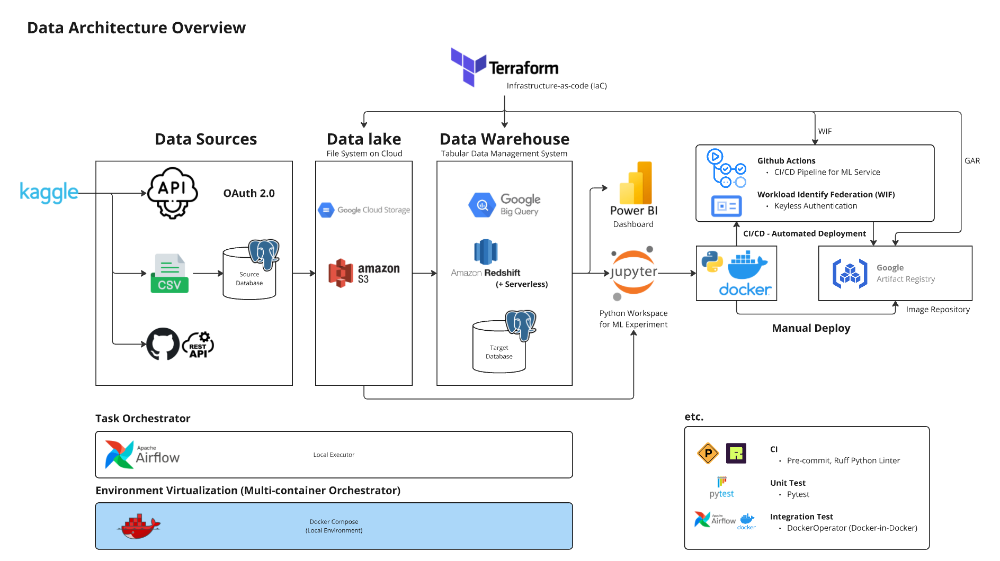
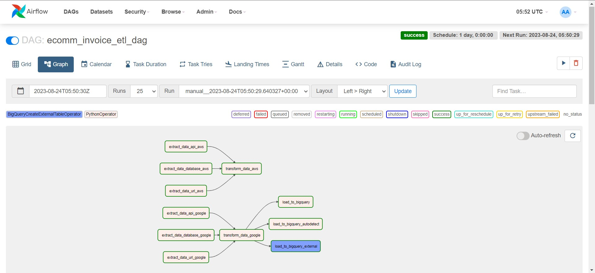
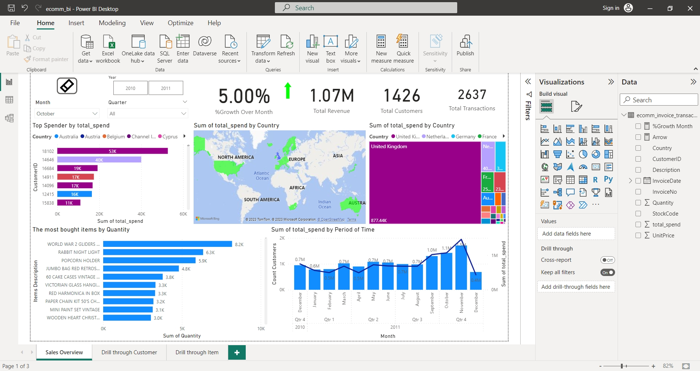
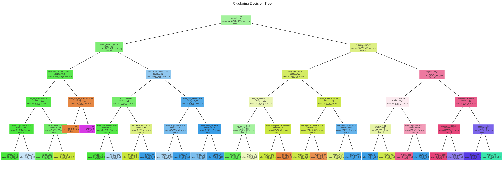

# 🛒 End-to-End E-Commerce Analytics & ML Deployment Pipeline

**Author**: Jani Shariff Shaik  
📧 shaikjanishariff@gmail.com  
🔗 [LinkedIn](https://www.linkedin.com/in/jani-shariff-shaik-374998292/) | 🌐 [Portfolio](https://janishariffshaik.wixstudio.com/portfolio) | 💻 [GitHub](https://github.com/Jani-Shaik-1406)

---

## 🚀 Project Overview

This is a full-scale, end-to-end e-commerce analytics project that simulates real-world data engineering, data science, and MLOps workflows. The project includes cloud-based ETL pipelines, automated machine learning workflows, data visualization, and interpretable customer segmentation—all powered by scalable infrastructure.

---

## 📦 Key Features

- **Cloud Infrastructure Setup** using Terraform across GCP and AWS
- **Containerized ETL Pipelines** using Docker and Airflow
- **Data Modeling & Optimization** with PostgreSQL and BigQuery
- **EDA & Power BI Dashboards** for retail insights
- **Customer Segmentation & Recommendation Models** (KMeans, XGBoost)
- **CI/CD Deployment Workflow** via GitHub Actions
- **Model Explainability** using Permutation Importance

---

## 🛠️ Technologies Used

- Python, SQL, Terraform, Docker, Airflow
- Google Cloud Platform (GCS, BigQuery)
- AWS (S3, Redshift)
- Power BI, Pandas, Scikit-learn, XGBoost
- GitHub Actions for CI/CD

---

## 📊 Business Use-Case

Retail businesses struggle to personalize customer experiences, manage marketing costs, and predict demand. This project:
- Segments customers using interpretable ML
- Identifies bundled products via Market Basket Analysis
- Forecasts sales using demand prediction models
- Creates actionable dashboards to empower non-technical teams

---

## 🔍 ML Use Cases

### 1. Customer Segmentation  
- Features engineered from purchase behavior
- KMeans clustering with Decision Tree rules for explainability

### 2. Market Basket Analysis  
- Apriori algorithm for association rule mining

### 3. Demand Forecasting  
- Time-series decomposition and Lag + Fourier-based prediction models

---

## 📁 Folder Structure

```plaintext
📦 ecommerce-mlops-project
├── airflow/               # DAGs & orchestration logic
├── data/                  # Input/processed datasets
├── docker/                # Dockerfiles and entrypoints
├── docs/                  # Visuals, dashboards, architecture
├── ml_models/             # Trained models, metadata, artifacts
├── notebooks/             # EDA, feature engineering, dev notebooks
├── src/                   # Modular source code
├── terraform/             # Infrastructure as code
└── requirements.txt
```

---

## 🖥️ Visual Highlights

**Project Architecture**  


**Airflow DAG View**  


**Power BI Dashboard**  


**KMeans Clusters + Tree Explanation**  


---

## 🔁 CI/CD Workflow

- Trained models are versioned and pushed to Artifact Registry
- GitHub Actions automates retraining, testing, and deployment
- Models are containerized and can be triggered through scheduled DAGs

---

## 📌 Key Outcomes

- Defined 10 interpretable customer segments for personalized marketing
- Identified high-lift product bundles for promotions
- Automated pipeline setup for reproducible training and deployment
- Enabled cloud scalability with containerized infrastructure

---

## 📬 Let's Connect!


🔗 [LinkedIn](https://www.linkedin.com/in/jani-shariff-shaik-374998292/)  
📧 shaikjanishariff@gmail.com

---

